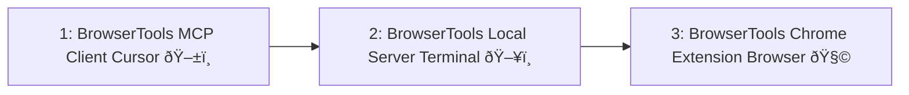

There are three distinct components to the BrowserTools MCP architecture.

```mermaid
graph LR;
    A[1: BrowserTools MCP Client Cursor 🖱ï¸] --> B[2: BrowserTools Local Server Terminal 🖥ï¸];
    B --> C[3: BrowserTools Chrome Extension Browser 🧩];
```

1: BrowserTools MCP Client Cursor

2: BrowserTools Local Server

3: BrowserTools Chrome Extension
